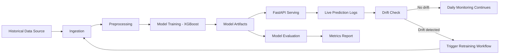

# System Architecture

This project demonstrates a free-tier MLOps architecture with automated training, serving, monitoring, and retraining triggers.

## High-Level Flow

## Components

- `src/data_ingest.py`: prepares historical training data (download + fallback generation).
- `src/simulate_live_data.py`: creates synthetic incoming applications.
- `src/preprocess.py`: validates and prepares train/live-ready datasets.
- `src/train.py`: trains XGBoost and stores model artifacts.
- `src/evaluate.py`: computes ROC-AUC, PR-AUC, and accuracy.
- `api/main.py`: serves `/predict`, `/health`, and `/model_info`.
- `monitoring/drift_check.py`: compares reference vs live distributions and flags drift.
- `.github/workflows/*.yml`: CI, training automation, and scheduled monitoring.

## Key Design Choices

- **Dual versioning**: Git for code + DVC for data snapshots.
- **Stateless serving**: API loads model artifacts generated by training pipeline.
- **Observable inference**: prediction requests are logged for drift checks.
- **Self-healing loop**: scheduled drift monitoring can dispatch retraining automatically.

## Free-Tier Tooling Map

- Data versioning: DVC + Google Drive
- Orchestration: GitHub Actions
- Experiment tracking: Weights & Biases
- Serving: FastAPI + Docker (deploy to HF Spaces or Render)
- Monitoring: Python + KS drift checks + Slack webhook alerts
