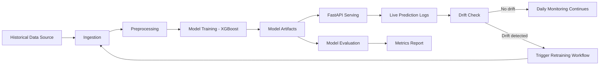

# Real-Time Credit Risk MLOps Project

## Recruiter TL;DR

- Built an end-to-end MLOps system with training, serving, drift monitoring, and automated retraining triggers.
- Implemented dual versioning with Git (code) and DVC (data) for reproducible model lineage.
- Shipped a production-style FastAPI service with validated inference endpoints and live prediction logging.
- Automated the lifecycle with GitHub Actions (CI, train pipeline, scheduled monitoring, artifact retention).

## 3-Minute Demo

Run one command:

`python -m scripts.portfolio_demo`

What this demonstrates:

1. historical data ingestion
2. live data simulation
3. preprocessing
4. model training
5. evaluation metrics generation
6. API prediction call
7. drift monitoring report generation

Key output files:

- `artifacts/model.joblib`
- `reports/metrics.json`
- `reports/drift_status.json`
- `data/raw/prediction_logs.csv`

# System Architecture

This project demonstrates a free-tier MLOps architecture with automated training, serving, monitoring, and retraining triggers.

## High-Level Flow

## Components

- `src/data_ingest.py`: prepares historical training data (download + fallback generation).
- `src/simulate_live_data.py`: creates synthetic incoming applications.
- `src/preprocess.py`: validates and prepares train/live-ready datasets.
- `src/train.py`: trains XGBoost and stores model artifacts.
- `src/evaluate.py`: computes ROC-AUC, PR-AUC, and accuracy.
- `api/main.py`: serves `/predict`, `/health`, and `/model_info`.
- `monitoring/drift_check.py`: compares reference vs live distributions and flags drift.
- `.github/workflows/*.yml`: CI, training automation, and scheduled monitoring.

## Key Design Choices

- **Dual versioning**: Git for code + DVC for data snapshots.
- **Stateless serving**: API loads model artifacts generated by training pipeline.
- **Observable inference**: prediction requests are logged for drift checks.
- **Self-healing loop**: scheduled drift monitoring can dispatch retraining automatically.

## Free-Tier Tooling Map

- Data versioning: DVC + Google Drive
- Orchestration: GitHub Actions
- Experiment tracking: Weights & Biases
- Serving: FastAPI + Docker (deploy to HF Spaces or Render)
- Monitoring: Python + KS drift checks + Slack webhook alerts

- **Problem:** "Credit risk models drift in production, so static notebooks are not enough."
- **Build:** "I built a full MLOps pipeline: ingestion, training, API serving, drift detection, and auto-retraining trigger."
- **Ops:** "GitHub Actions runs CI, training jobs, and daily drift checks. Drift can dispatch retraining and send Slack alerts."
- **Repro:** "I use Git + DVC so each model can be traced to exact code/data snapshots."
- **Impact:** "This demonstrates production readiness, not just model experimentation."

---

## First-time packaging (W&B, Slack, Drive, Hugging Face)

Step-by-step checklist: [docs/PACKAGING.md](docs/PACKAGING.md)

Architecture reference: [ARCHITECTURE.md](ARCHITECTURE.md)
